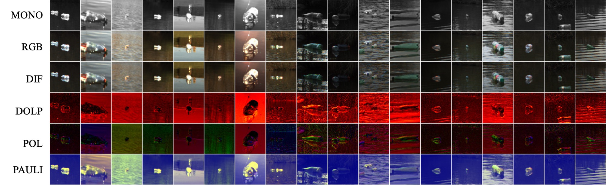

# PoTATO - A Dataset for Analyzing Polarimetric Traces of Afloat Trash Objects

## Description 
This repository contains the scripts and code for the paper [PoTATO: A Dataset for Analyzing Polarimetric
Traces of Afloat Trash Objects](https://arxiv.org/abs/2409.12659) presented during the [ECCV24 TRICKY workshop](https://sites.google.com/view/eccv24-tricky-workshop/#h.h0s7c37d7fmm). It allows for easy replication of the experiments and supports research reproducibility.

The PoTATO dataset contains more than 12k labeled plastic bottles with RAW polarimetric and color images.

### Extracted Channels

Example of channels that can be extracted from the RAW images.


___

### Example bottles in the dataset

Example of bottle images and the different channels that can be extracted.



Bottles used in the experiment.

___

### Detection Example

The sequence of images illustrates the object detection that can be implemented independently each channel.


___


## Steps for reproducing the experiments

1. Clone this repository:
```bash
git clone https://github.com/luisfelipewb/PoTATO/tree/eccv2024
```

2. Download the PoTATO dataset from [dataset link](https://gtvault-my.sharepoint.com/:f:/g/personal/lbatista3_gatech_edu/EsRU8LnjkXZLl7bPbMqJfaIBIaKVCaSlDyo6ZC_BisbLsw?e=QrcWvj):
```bash
mv ~/Downloads/potato.tgz ./datasets
cd ./datasets && tar -xzvf potato.tgz
```

3. Extract the images from the RAW data (This might take a while and will need 25GB space). The imagess will be generated in the same folder as the raw files:
```bash
cd ../
python3 utils/extract_from_raw.py -d datasets/potato/images_raw/
```

4. Place images in the correct folder:
```bash
find ./datasets/potato/images_raw/ -type f ! -name '*_raw.png' -exec mv {} ./datasets/potato/images/ \;
```

5. Install YOLO-v5:
Same instructions from the YOLOv5 repository [https://github.com/ultralytics/yolov5](https://github.com/ultralytics/yolov5)
The 'yolov5' folder should be on the same level as the 'experiments' folder
```bash
git clone https://github.com/ultralytics/yolov5
pip install -r ./yolov5/requirements.txt
```

6. Run YOLO training and detection:
```bash
cd ./experiments/
./train_yolo.sh
```

7. Install Detectron2 and remaining dependencies.
```bash
pip install r ./requirements.txt
```

8. Run Detectron2 training:
```bash
./train_det2.sh
```

9. Fix the `image_id` in yolo detection. The `image_id` used for the YOLO detections does no correspond to the annotation. The following script updates the `image_id` for extracting the COCO metrics
```bash
cd utils
python3 fix_yolo_detections.py
```

10. Generate metrics
```bash
python3 coco_metrics.py
```
The results will be avaiable in `utils/output/metrics.csv`

Please cite the paper when using the dataset or code
```bibtex
@misc{batista2024potatodatasetanalyzingpolarimetric,
      title={PoTATO: A Dataset for Analyzing Polarimetric Traces of Afloat Trash Objects}, 
      author={Luis Felipe Wolf Batista and Salim Khazem and Mehran Adibi and Seth Hutchinson and Cedric Pradalier},
      year={2024},
      eprint={2409.12659},
      archivePrefix={arXiv},
      primaryClass={cs.CV},
      url={https://arxiv.org/abs/2409.12659}, 
}


```


